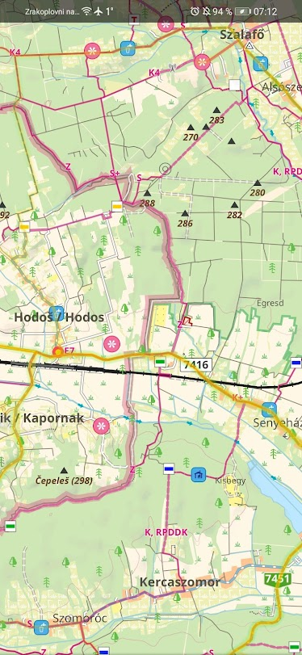
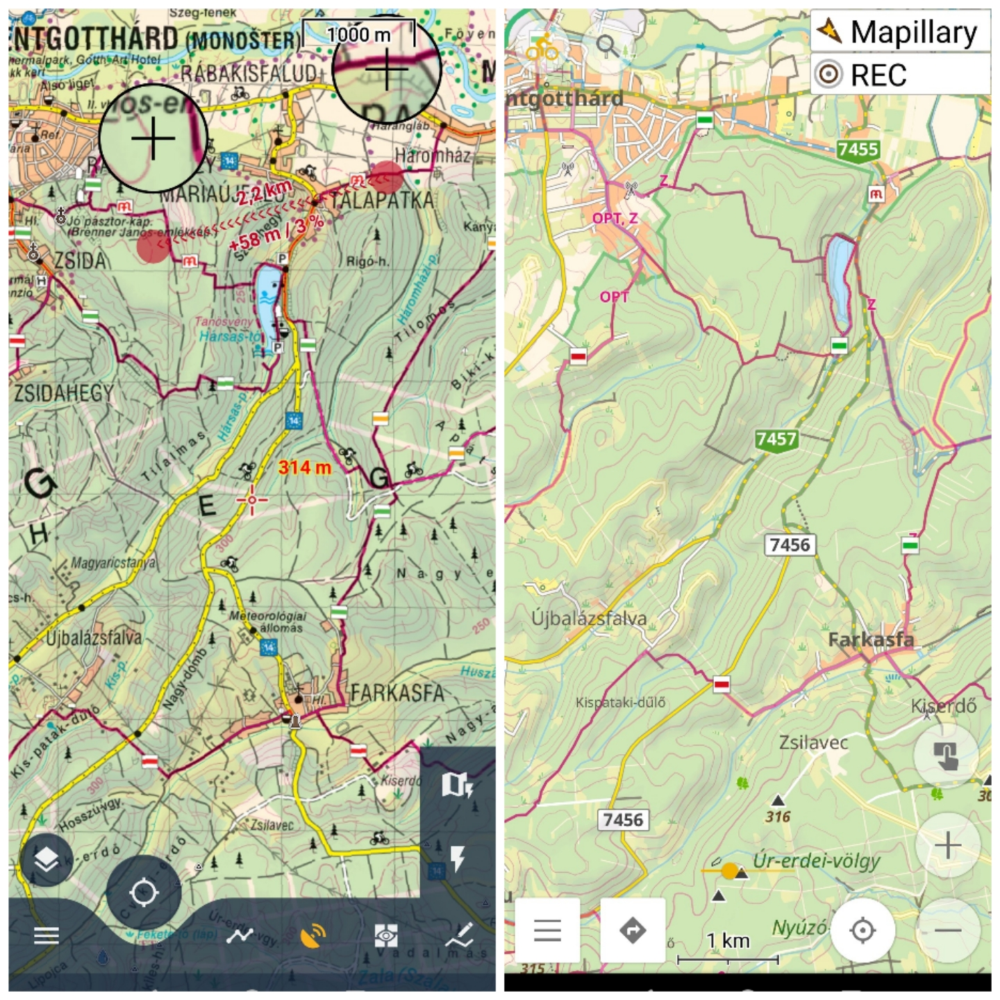
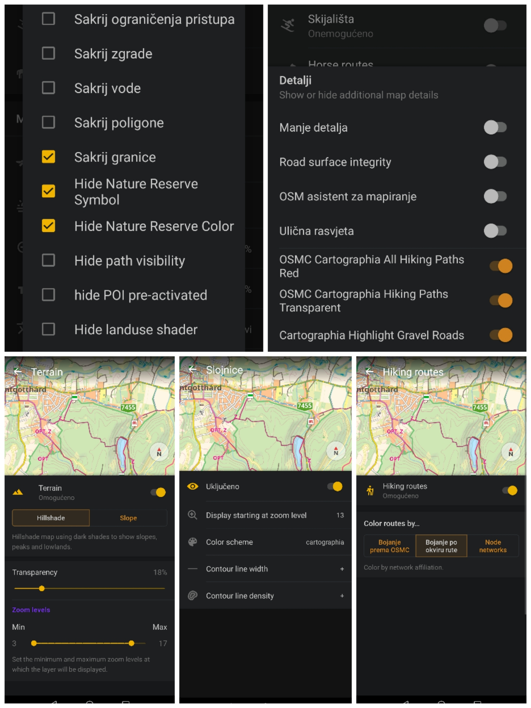

# osmand-cartographia
Cartographia.hu colorway for osmand
 
 
fork of https://github.com/Hades1503/OsmAnd_Hiking_Map.git with Cartographia pastel-y colorway. 
Settings necessary: 
 
 
Can mainly be used for hiking and gravel riding, where hiking path and gravel tracks and unpaved roads stand out in purple(or yellow highlights for gravel).
 
WIP!!!!
